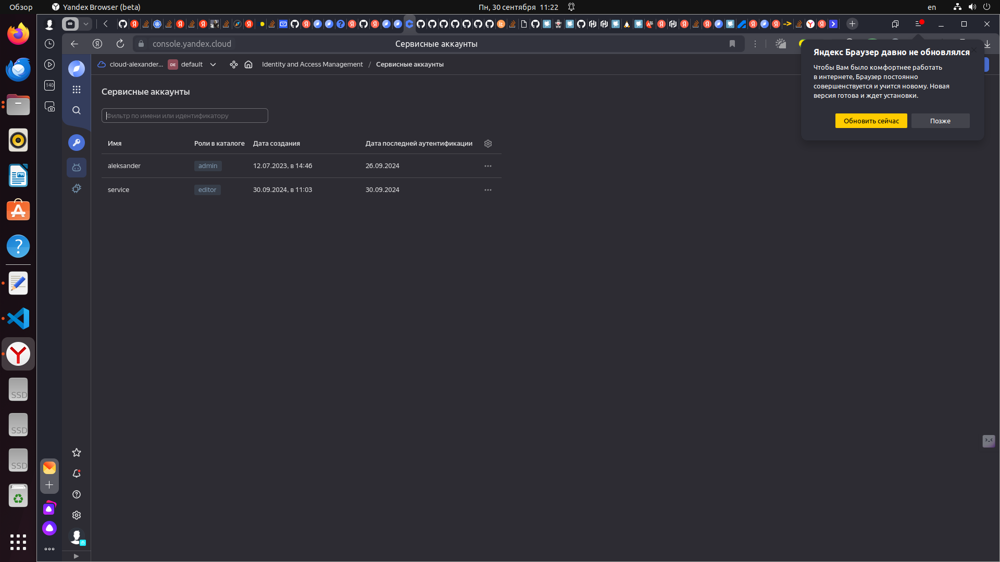
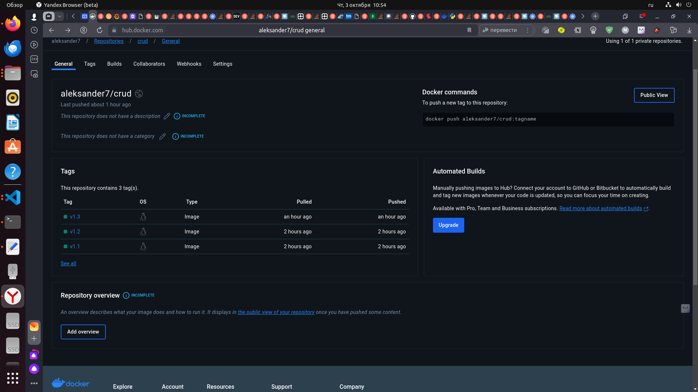
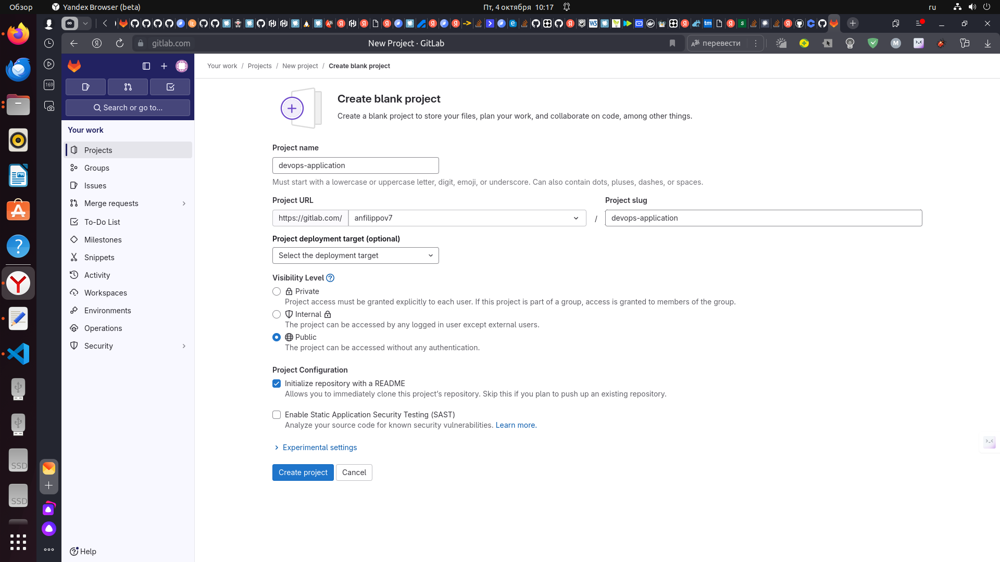

# Дипломный практикум в Yandex.Cloud
  * [Цели:](#цели)
  * [Этапы выполнения:](#этапы-выполнения)
     * [Создание облачной инфраструктуры](#создание-облачной-инфраструктуры)
     * [Создание Kubernetes кластера](#создание-kubernetes-кластера)
     * [Создание тестового приложения](#создание-тестового-приложения)
     * [Подготовка cистемы мониторинга и деплой приложения](#подготовка-cистемы-мониторинга-и-деплой-приложения)
     * [Установка и настройка CI/CD](#установка-и-настройка-cicd)
  * [Что необходимо для сдачи задания?](#что-необходимо-для-сдачи-задания)
  * [Как правильно задавать вопросы дипломному руководителю?](#как-правильно-задавать-вопросы-дипломному-руководителю)

**Перед началом работы над дипломным заданием изучите [Инструкция по экономии облачных ресурсов](https://github.com/netology-code/devops-materials/blob/master/cloudwork.MD).**

---
## Цели:

1. Подготовить облачную инфраструктуру на базе облачного провайдера Яндекс.Облако.
2. Запустить и сконфигурировать Kubernetes кластер.
3. Установить и настроить систему мониторинга.
4. Настроить и автоматизировать сборку тестового приложения с использованием Docker-контейнеров.
5. Настроить CI для автоматической сборки и тестирования.
6. Настроить CD для автоматического развёртывания приложения.

---
## Этапы выполнения:


### Создание облачной инфраструктуры

Для начала необходимо подготовить облачную инфраструктуру в ЯО при помощи [Terraform](https://www.terraform.io/).

Особенности выполнения:

- Бюджет купона ограничен, что следует иметь в виду при проектировании инфраструктуры и использовании ресурсов;
Для облачного k8s используйте региональный мастер(неотказоустойчивый). Для self-hosted k8s минимизируйте ресурсы ВМ и долю ЦПУ. В обоих вариантах используйте прерываемые ВМ для worker nodes.
- Следует использовать версию [Terraform](https://www.terraform.io/) не старше 1.5.x .

Предварительная подготовка к установке и запуску Kubernetes кластера.

1. Создайте сервисный аккаунт, который будет в дальнейшем использоваться Terraform для работы с инфраструктурой с необходимыми и достаточными правами. Не стоит использовать права суперпользователя
2. Подготовьте [backend](https://www.terraform.io/docs/language/settings/backends/index.html) для Terraform:  
   а. Рекомендуемый вариант: S3 bucket в созданном ЯО аккаунте(создание бакета через TF)
   б. Альтернативный вариант:  [Terraform Cloud](https://app.terraform.io/)  
3. Создайте VPC с подсетями в разных зонах доступности.
4. Убедитесь, что теперь вы можете выполнить команды `terraform destroy` и `terraform apply` без дополнительных ручных действий.
5. В случае использования [Terraform Cloud](https://app.terraform.io/) в качестве [backend](https://www.terraform.io/docs/language/settings/backends/index.html) убедитесь, что применение изменений успешно проходит, используя web-интерфейс Terraform cloud.

Ожидаемые результаты:

1. Terraform сконфигурирован и создание инфраструктуры посредством Terraform возможно без дополнительных ручных действий.
2. Полученная конфигурация инфраструктуры является предварительной, поэтому в ходе дальнейшего выполнения задания возможны изменения.


## Выполнение задания:

Предварительная подготовка к установке и запуску Kubernetes кластера.


1. Создаем сервисный аккаунт, который будет использоваться Terraform для работы с инфраструктурой.

<details>
<summary>Пишем код для создания аккаунта, бэкенда и каталога для S3 bucket с помощью `terraform`, содержимое файла account.tf (в каталоге terraform_s3_network)</summary>

```
# Создаем сервисный аккаунт для Terraform
resource "yandex_iam_service_account" "service" {
  folder_id = var.FOLDER_ID
  name      = var.account_name
}

# Выдаем роль editor сервисному аккаунту Terraform
resource "yandex_resourcemanager_folder_iam_member" "service_editor" {
  folder_id = var.FOLDER_ID
  role      = "editor"
  member    = "serviceAccount:${yandex_iam_service_account.service.id}"
}

# Создаем статический ключ доступа для сервисного аккаунта
resource "yandex_iam_service_account_static_access_key" "terraform_service_account_key" {
  service_account_id = yandex_iam_service_account.service.id
}

# Используем ключ доступа для создания бакета
resource "yandex_storage_bucket" "tf-bucket" {
  bucket     = var.bucket_name
  access_key = yandex_iam_service_account_static_access_key.terraform_service_account_key.access_key
  secret_key = yandex_iam_service_account_static_access_key.terraform_service_account_key.secret_key

  anonymous_access_flags {
    read = false
    list = false
  }

  force_destroy = true

# Записываем ключи в файл backend.tfvars
provisioner "local-exec" {
  command = "echo export ACCESS_KEY=${yandex_iam_service_account_static_access_key.terraform_service_account_key.access_key} > ../terraform_prod/backend.tfvars"
}

provisioner "local-exec" {
  command = "echo export SECRET_KEY=${yandex_iam_service_account_static_access_key.terraform_service_account_key.secret_key} >> ../terraform_prod/backend.tfvars"
}
}
```

</details>  

2. Пробуем выполение созданного кода, проверяем работу команд `terraform apply` и `terraform destroy`.

<details>

<summary>Создание ресурсов</summary>


```
aleksander@aleksander-System-Product-Name:~/devops-diplom-yandexcloud/terraform_s3_network$ terraform apply

Terraform used the selected providers to generate the following execution plan. Resource actions are indicated with the following symbols:
  + create

Terraform will perform the following actions:

  # yandex_iam_service_account.service will be created
  + resource "yandex_iam_service_account" "service" {
      + created_at = (known after apply)
      + folder_id  = (sensitive value)
      + id         = (known after apply)
      + name       = "service"
    }

  # yandex_iam_service_account_static_access_key.terraform_service_account_key will be created
  + resource "yandex_iam_service_account_static_access_key" "terraform_service_account_key" {
      + access_key           = (known after apply)
      + created_at           = (known after apply)
      + encrypted_secret_key = (known after apply)
      + id                   = (known after apply)
      + key_fingerprint      = (known after apply)
      + secret_key           = (sensitive value)
      + service_account_id   = (known after apply)
    }

  # yandex_resourcemanager_folder_iam_member.service_editor will be created
  + resource "yandex_resourcemanager_folder_iam_member" "service_editor" {
      + folder_id = (sensitive value)
      + id        = (known after apply)
      + member    = (known after apply)
      + role      = "editor"
    }

  # yandex_storage_bucket.tf-bucket will be created
  + resource "yandex_storage_bucket" "tf-bucket" {
      + access_key            = (known after apply)
      + acl                   = "private"
      + bucket                = "diplom-state"
      + bucket_domain_name    = (known after apply)
      + default_storage_class = (known after apply)
      + folder_id             = (known after apply)
      + force_destroy         = true
      + id                    = (known after apply)
      + secret_key            = (sensitive value)
      + website_domain        = (known after apply)
      + website_endpoint      = (known after apply)

      + anonymous_access_flags {
          + list = false
          + read = false
        }
    }

Plan: 4 to add, 0 to change, 0 to destroy.

Do you want to perform these actions?
  Terraform will perform the actions described above.
  Only 'yes' will be accepted to approve.

  Enter a value: yes

yandex_iam_service_account.service: Creating...
yandex_iam_service_account.service: Creation complete after 3s [id=ajeuseefvsihcbqb6obr]
yandex_iam_service_account_static_access_key.terraform_service_account_key: Creating...
yandex_resourcemanager_folder_iam_member.service_editor: Creating...
yandex_iam_service_account_static_access_key.terraform_service_account_key: Creation complete after 1s [id=aje7gk08pprkqtnaveuj]
yandex_storage_bucket.tf-bucket: Creating...
yandex_resourcemanager_folder_iam_member.service_editor: Creation complete after 2s [id=b1g7kr9i41eoi2fqj52o/editor/serviceAccount:ajeuseefvsihcbqb6obr]
yandex_storage_bucket.tf-bucket: Provisioning with 'local-exec'...
yandex_storage_bucket.tf-bucket (local-exec): Executing: ["/bin/sh" "-c" "echo export ACCESS_KEY=YCAJEA-j1KGvx5dQmA71PZLZb > ../terraform_prod/backend.tfvars"]
yandex_storage_bucket.tf-bucket: Provisioning with 'local-exec'...
yandex_storage_bucket.tf-bucket (local-exec): (output suppressed due to sensitive value in config)
yandex_storage_bucket.tf-bucket: Creation complete after 4s [id=diplom-state]

Apply complete! Resources: 4 added, 0 changed, 0 destroyed.
```

Проверяем создание ресурсов в консоли ЯО:

аккаунт `service` создан:
<p align="center">
  
</p>

бакет `diplom-state` создан:
<p align="center">
  
</p>

</details>

<details>

<summary>Удаление ресурсов</summary>

```
aleksander@aleksander-System-Product-Name:~/devops-diplom-yandexcloud/terraform_s3_network$ terraform destroy
yandex_iam_service_account.service: Refreshing state... [id=ajeuseefvsihcbqb6obr]
yandex_resourcemanager_folder_iam_member.service_editor: Refreshing state... [id=b1g7kr9i41eoi2fqj52o/editor/serviceAccount:ajeuseefvsihcbqb6obr]
yandex_iam_service_account_static_access_key.terraform_service_account_key: Refreshing state... [id=aje7gk08pprkqtnaveuj]
yandex_storage_bucket.tf-bucket: Refreshing state... [id=diplom-state]

Terraform used the selected providers to generate the following execution plan. Resource actions are indicated with the following symbols:
  - destroy

Terraform will perform the following actions:

  # yandex_iam_service_account.service will be destroyed
  - resource "yandex_iam_service_account" "service" {
      - created_at = "2024-09-30T08:03:58Z" -> null
      - folder_id  = (sensitive value) -> null
      - id         = "ajeuseefvsihcbqb6obr" -> null
      - name       = "service" -> null
    }

  # yandex_iam_service_account_static_access_key.terraform_service_account_key will be destroyed
  - resource "yandex_iam_service_account_static_access_key" "terraform_service_account_key" {
      - access_key         = "YCAJEA-j1KGvx5dQmA71PZLZb" -> null
      - created_at         = "2024-09-30T08:04:01Z" -> null
      - id                 = "aje7gk08pprkqtnaveuj" -> null
      - secret_key         = (sensitive value) -> null
      - service_account_id = "ajeuseefvsihcbqb6obr" -> null
    }

  # yandex_resourcemanager_folder_iam_member.service_editor will be destroyed
  - resource "yandex_resourcemanager_folder_iam_member" "service_editor" {
      - folder_id = (sensitive value) -> null
      - id        = "b1g7kr9i41eoi2fqj52o/editor/serviceAccount:ajeuseefvsihcbqb6obr" -> null
      - member    = "serviceAccount:ajeuseefvsihcbqb6obr" -> null
      - role      = "editor" -> null
    }

  # yandex_storage_bucket.tf-bucket will be destroyed
  - resource "yandex_storage_bucket" "tf-bucket" {
      - access_key            = "YCAJEA-j1KGvx5dQmA71PZLZb" -> null
      - acl                   = "private" -> null
      - bucket                = "diplom-state" -> null
      - bucket_domain_name    = "diplom-state.storage.yandexcloud.net" -> null
      - default_storage_class = "STANDARD" -> null
      - folder_id             = "b1g7kr9i41eoi2fqj52o" -> null
      - force_destroy         = true -> null
      - id                    = "diplom-state" -> null
      - max_size              = 0 -> null
      - secret_key            = (sensitive value) -> null

      - anonymous_access_flags {
          - list = false -> null
          - read = false -> null
        }

      - versioning {
          - enabled = false -> null
        }
    }

Plan: 0 to add, 0 to change, 4 to destroy.

Do you really want to destroy all resources?
  Terraform will destroy all your managed infrastructure, as shown above.
  There is no undo. Only 'yes' will be accepted to confirm.

  Enter a value: yes

yandex_resourcemanager_folder_iam_member.service_editor: Destroying... [id=b1g7kr9i41eoi2fqj52o/editor/serviceAccount:ajeuseefvsihcbqb6obr]
yandex_storage_bucket.tf-bucket: Destroying... [id=diplom-state]
yandex_resourcemanager_folder_iam_member.service_editor: Destruction complete after 3s
yandex_storage_bucket.tf-bucket: Still destroying... [id=diplom-state, 10s elapsed]
yandex_storage_bucket.tf-bucket: Destruction complete after 11s
yandex_iam_service_account_static_access_key.terraform_service_account_key: Destroying... [id=aje7gk08pprkqtnaveuj]
yandex_iam_service_account_static_access_key.terraform_service_account_key: Destruction complete after 1s
yandex_iam_service_account.service: Destroying... [id=ajeuseefvsihcbqb6obr]
yandex_iam_service_account.service: Destruction complete after 3s

Destroy complete! Resources: 4 destroyed.
```

</details>


 
---
### Создание Kubernetes кластера

На этом этапе необходимо создать [Kubernetes](https://kubernetes.io/ru/docs/concepts/overview/what-is-kubernetes/) кластер на базе предварительно созданной инфраструктуры.   Требуется обеспечить доступ к ресурсам из Интернета.

Это можно сделать двумя способами:

1. Рекомендуемый вариант: самостоятельная установка Kubernetes кластера.  
   а. При помощи Terraform подготовить как минимум 3 виртуальных машины Compute Cloud для создания Kubernetes-кластера. Тип виртуальной машины следует выбрать самостоятельно с учётом требовании к производительности и стоимости. Если в дальнейшем поймете, что необходимо сменить тип инстанса, используйте Terraform для внесения изменений.  
   б. Подготовить [ansible](https://www.ansible.com/) конфигурации, можно воспользоваться, например [Kubespray](https://kubernetes.io/docs/setup/production-environment/tools/kubespray/)  
   в. Задеплоить Kubernetes на подготовленные ранее инстансы, в случае нехватки каких-либо ресурсов вы всегда можете создать их при помощи Terraform.
2. Альтернативный вариант: воспользуйтесь сервисом [Yandex Managed Service for Kubernetes](https://cloud.yandex.ru/services/managed-kubernetes)  
  а. С помощью terraform resource для [kubernetes](https://registry.terraform.io/providers/yandex-cloud/yandex/latest/docs/resources/kubernetes_cluster) создать **региональный** мастер kubernetes с размещением нод в разных 3 подсетях      
  б. С помощью terraform resource для [kubernetes node group](https://registry.terraform.io/providers/yandex-cloud/yandex/latest/docs/resources/kubernetes_node_group)
  
Ожидаемый результат:

1. Работоспособный Kubernetes кластер.
2. В файле `~/.kube/config` находятся данные для доступа к кластеру.
3. Команда `kubectl get pods --all-namespaces` отрабатывает без ошибок.

## Выполнение задания:

1. Создаем VPC с подсетями в разных зонах доступности.

<details>

<summary>Пишем код для создания VPC с подсетями с помощью `terraform`, содержимое файла networks.tf (в каталоге terraform_prod)</summary>

```
# networks
resource "yandex_vpc_network" "net" {
  name = "net"
}

resource "yandex_vpc_subnet" "subnet-a" {
  name           = "subnet-a"
  zone           = "ru-central1-a"
  network_id     = yandex_vpc_network.net.id
  v4_cidr_blocks = ["10.10.10.0/24"]
}

resource "yandex_vpc_subnet" "subnet-b" {
  name           = "subnet-b"
  zone           = "ru-central1-b"
  network_id     = yandex_vpc_network.net.id
  v4_cidr_blocks = ["10.10.20.0/24"]
}
```

</details> 

2. При помощи Terraform подготовим 3 виртуальных машины Compute Cloud на которых затем будем разворачивать Kubernetes-кластер.


<details>

<summary>Код Terraform для создания виртуальных машин, записанный в файле main.tf (в каталоге terraform_prod):</summary>

Для подключения к создаваемым виртуальным машинам с нашей локальной машины предварительно создаем на нашей локальной машине ключ достура с помощью команды `ssh-keygen -t ed25519`, затем с помощью Terraform этот код записывается в соответствующие переменные.

```
locals {
  ssh-keys = fileexists("~/.ssh/id_ed25519.pub") ? file("~/.ssh/id_ed25519.pub") : var.ssh_public_key
  ssh-private-keys = fileexists("~/.ssh/id_ed25519") ? file("~/.ssh/id_ed25519") : var.ssh_private_key
}

data "template_file" "meta" {
 template = file("${path.module}/meta.yml")
 vars = {
   ssh_public_key = local.ssh-keys
   ssh_private_key = local.ssh-private-keys
 }
}


# instances
data "yandex_compute_image" "ubuntu" {
  family = "ubuntu-2004-lts"
}

resource "yandex_compute_instance" "control" {
  name = "control"
  zone = "ru-central1-a"
  hostname = "control"
  allow_stopping_for_update = true

  resources {
    core_fraction = var.core_fraction
    cores = 2
    memory = 2
  }

  boot_disk {
    initialize_params {
      image_id = data.yandex_compute_image.ubuntu.id
      size = 20
      type = var.disk_type
    }
  }

  network_interface {
    subnet_id = yandex_vpc_subnet.subnet-a.id
    ip_address = "10.10.10.10"
    nat = true
  }

  metadata = {
    ssh-keys = "ubuntu:${local.ssh-keys}"
    serial-port-enable = "1"
    user-data          = data.template_file.meta.rendered
  }

  scheduling_policy {
    preemptible = var.preemptible
  }
}

resource "yandex_compute_instance" "node1" {
  name = "node1"
  zone = "ru-central1-b"
  hostname = "node1"
  allow_stopping_for_update = true

  resources {
    core_fraction = var.core_fraction
    cores = 2
    memory = 2
  }

  boot_disk {
    initialize_params {
      image_id = data.yandex_compute_image.ubuntu.id
      size = 20
      type = var.disk_type
    }
  }

  network_interface {
    subnet_id = yandex_vpc_subnet.subnet-b.id
    ip_address = "10.10.20.11"
    nat = true
  }

  metadata = {
    ssh-keys = "ubuntu:${local.ssh-keys}"
    serial-port-enable = "1"
    user-data          = data.template_file.meta.rendered
  }

```

</details>

3. Для разворачивания Kubernetes-кластера скачиваем на свою локальную машину [Kubespray](https://kubernetes.io/docs/setup/production-environment/tools/kubespray/)

<details>

<summary>Подготавливаем файл ansible.tf для установки Kubernetes-кластера, (в каталоге terraform_prod):</summary> 

В результате в файл hosts.yaml записываются ip адреса созданных виртуальных машин и далее выполняется плейбук из состава библиотеки Kubespray: 

```
resource "local_file" "ansible_inventory" { 
  content = templatefile("${path.module}/hosts.tftpl", {
    control_ext_ip = yandex_compute_instance.control.network_interface.0.nat_ip_address
    control_int_ip = yandex_compute_instance.control.network_interface.0.ip_address
    node1_ext_ip   = yandex_compute_instance.node1.network_interface.0.nat_ip_address
    node1_int_ip   = yandex_compute_instance.node1.network_interface.0.ip_address
    node2_ext_ip   = yandex_compute_instance.node2.network_interface.0.nat_ip_address
    node2_int_ip   = yandex_compute_instance.node2.network_interface.0.ip_address   
  })
  filename = "../kubespray/inventory/k8s_cluster/hosts.yaml"
}

resource "null_resource" "show_env" {
  depends_on = [
    local_file.ansible_inventory
  ]

  provisioner "local-exec" {
    command = "echo -e \"\\n========================= HOSTS.YAML START =========================\\n\" && cat ../kubespray/inventory/k8s_cluster/hosts.yaml && echo -e \"\\n========================== HOSTS.YAML END ==========================\\n\""
  }
}


resource "null_resource" "wait_for_port_22_control" {
  depends_on = [
    local_file.ansible_inventory
  ]

  provisioner "local-exec" {
    command = "while ! nc -z ${yandex_compute_instance.control.network_interface.0.nat_ip_address}   22; do sleep   5; done"
  }
}

resource "null_resource" "wait_for_port_22_node1" {
  depends_on = [
    local_file.ansible_inventory
  ]

  provisioner "local-exec" {
    command = "while ! nc -z ${yandex_compute_instance.node1.network_interface.0.nat_ip_address}   22; do sleep   5; done"
  }
}

resource "null_resource" "wait_for_port_22_node2" {
  depends_on = [
    local_file.ansible_inventory
  ]

  provisioner "local-exec" {
    command = "while ! nc -z ${yandex_compute_instance.node2.network_interface.0.nat_ip_address}   22; do sleep   5; done"
  }
}

resource "null_resource" "ansible_provisioner" {
  depends_on = [
    local_file.ansible_inventory,
    null_resource.wait_for_port_22_control,
    null_resource.wait_for_port_22_node1,
    null_resource.wait_for_port_22_node2
  ]

  provisioner "local-exec" {
    command = "cd ../kubespray && ansible-playbook -i inventory/k8s_cluster/hosts.yaml cluster.yml -b --become-user=root"
  }
}
```

</details>


4. Перед выполнением кода для создания виртуальных машин и должен быть выполнен код из каталога terraform_s3_network создания аккаунта, бэкенда и каталога для S3 bucket 

После выполения вышеобозначенного кода в файле backend.tfvars создаются ключи ACCESS_KEY и SECRET_KEY, выполняем инициализию бэкенд с помощью кода terraform init -backend-config="access_key=<your access key>" -backend-config="secret_key=<your secret key>"

<details>

<summary>Выполняем `terraform apply`, в результате создаются ВМ и с помощью ansible (файл ansible.tf) разворачивается Kubernetes-кластер на созданных ВМ</summary> 

Результат выполнения кода terraform и плейбука ansible:

<p align="center">
  
</p>

сеть и подсети `net` созданы:
<p align="center">
  
</p>
<p align="center">
  
</p>

</details>


После выполнения кода (создания ВМ и Kubernetes-кластера) на управляющей ноде создаем директорию для хранения файла конфигурации, копируем созданный при установке Kubernetes кластера конфигурационный файл в эту директорию, и назначаем права для пользователя на директорию и файл конфигурации :

<details>

```
aleksander@aleksander-System-Product-Name:~/devops-application$ ssh ubuntu@89.169.129.94
Welcome to Ubuntu 20.04.6 LTS (GNU/Linux 5.4.0-196-generic x86_64)

 * Documentation:  https://help.ubuntu.com
 * Management:     https://landscape.canonical.com
 * Support:        https://ubuntu.com/pro
New release '22.04.5 LTS' available.
Run 'do-release-upgrade' to upgrade to it.

Last login: Thu Oct  3 06:03:37 2024 from 89.109.5.129
ubuntu@control:~$ mkdir ~/.kube
ubuntu@control:~$ sudo cp /etc/kubernetes/admin.conf ~/.kube/config
ubuntu@control:~$ sudo chown -R ubuntu:ubuntu $HOME/.kube/config
ubuntu@control:~$ ll ~/.kube
total 16
drwxrwxr-x 2 ubuntu ubuntu 4096 Oct  1 07:37 ./
drwxr-xr-x 6 ubuntu ubuntu 4096 Oct  1 07:37 ../
-rw------- 1 ubuntu ubuntu 5665 Oct  1 07:37 config
```

</details>

Проверяем доступность подов и нод кластера:

<details>

```
ubuntu@control:~$ kubectl get pods --all-namespaces
NAMESPACE     NAME                                      READY   STATUS    RESTARTS      AGE
kube-system   calico-kube-controllers-648dffd99-w74bq   1/1     Running   0             22h
kube-system   calico-node-9kd5c                         1/1     Running   0             22h
kube-system   calico-node-fdjf9                         1/1     Running   0             22h
kube-system   calico-node-njz9f                         1/1     Running   0             22h
kube-system   coredns-69db55dd76-bf27j                  1/1     Running   0             22h
kube-system   coredns-69db55dd76-dfchp                  1/1     Running   0             22h
kube-system   dns-autoscaler-6f4b597d8c-nfxg2           1/1     Running   0             22h
kube-system   kube-apiserver-control                    1/1     Running   1             22h
kube-system   kube-controller-manager-control           1/1     Running   2             22h
kube-system   kube-proxy-jlbz5                          1/1     Running   0             22h
kube-system   kube-proxy-mlwht                          1/1     Running   0             22h
kube-system   kube-proxy-wm6j5                          1/1     Running   0             22h
kube-system   kube-scheduler-control                    1/1     Running   2 (22h ago)   22h
kube-system   nginx-proxy-node1                         1/1     Running   0             22h
kube-system   nginx-proxy-node2                         1/1     Running   0             22h
kube-system   nodelocaldns-6v9t5                        1/1     Running   0             22h
kube-system   nodelocaldns-hj6pt                        1/1     Running   0             22h
kube-system   nodelocaldns-zlxff                        1/1     Running   0             22h
ubuntu@control:~$ kubectl get nodes
NAME      STATUS   ROLES           AGE   VERSION
control   Ready    control-plane   22h   v1.29.1
node1     Ready    <none>          22h   v1.29.1
node2     Ready    <none>          22h   v1.29.1
```

</details>

---
### Создание тестового приложения

Для перехода к следующему этапу необходимо подготовить тестовое приложение, эмулирующее основное приложение разрабатываемое вашей компанией.

Способ подготовки:

1. Рекомендуемый вариант:  
   а. Создайте отдельный git репозиторий с простым nginx конфигом, который будет отдавать статические данные.  
   б. Подготовьте Dockerfile для создания образа приложения.  
2. Альтернативный вариант:  
   а. Используйте любой другой код, главное, чтобы был самостоятельно создан Dockerfile.

Ожидаемый результат:

1. Git репозиторий с тестовым приложением и Dockerfile.
2. Регистри с собранным docker image. В качестве регистри может быть DockerHub или [Yandex Container Registry](https://cloud.yandex.ru/services/container-registry), созданный также с помощью terraform.


## Выполнение задания:

1. Для выполнения задания создаем отдельный git репозиторий, в который разместим файлы django приложения и Dockerfile для создания образа этого приложения.

<details>

<summary>Создаем Dockerfile который создает контейнер с django приложением:</summary>

```
FROM python:3.10.1
WORKDIR /app/
COPY ./stocks_products .
ENV PYTHONDONTWRITEBYTECODE 1
ENV PYTHONUNBUFFERED 1

RUN python -m venv /venv
ENV PATH="/venv/bin:$PATH"

RUN pip install --upgrade pip
RUN pip install -r requirements.txt
RUN python3 manage.py migrate
EXPOSE 8000

ENTRYPOINT ["python", "manage.py", "runserver", "0.0.0.0:8000"]
```

</details>

Для того чтобы приложение django работало на кластере в файле настроек django (settings.py) прописываем IP-адрес управляющей ноды ALLOWED_HOSTS = ['89.169.129.94']

<details>

<summary>Запускаем сборку Docker образа:</summary>

```
aleksander@aleksander-System-Product-Name:~/devops-application$ docker build -t aleksander7/crud:v3 .
[+] Building 17.2s (12/12) FINISHED                                                                              docker:default
 => [internal] load build definition from Dockerfile                                                                       0.0s
 => => transferring dockerfile: 381B                                                                                       0.0s
 => [internal] load metadata for docker.io/library/python:3.10.1                                                           0.5s
 => [internal] load .dockerignore                                                                                          0.0s
 => => transferring context: 2B                                                                                            0.0s
 => [1/7] FROM docker.io/library/python:3.10.1@sha256:b39f8b98308263406dc266ce9244f2e00f0d367003b401543d39854a10bd2786     0.0s
 => [internal] load build context                                                                                          0.0s
 => => transferring context: 6.01kB                                                                                        0.0s
 => CACHED [2/7] WORKDIR /app/                                                                                             0.0s
 => [3/7] COPY ./stocks_products .                                                                                         0.0s
 => [4/7] RUN python -m venv /venv                                                                                         3.1s
 => [5/7] RUN pip install --upgrade pip                                                                                    2.9s
 => [6/7] RUN pip install -r requirements.txt                                                                              8.9s 
 => [7/7] RUN python3 manage.py migrate                                                                                    0.9s 
 => exporting to image                                                                                                     0.6s 
 => => exporting layers                                                                                                    0.6s 
 => => writing image sha256:1ede9ff7718957386bf8e472432b3afd1904f03d7f9d60aa947e5fc3de9a3d1f                               0.0s 
 => => naming to docker.io/aleksander7/crud:v3                                                                                                                                      0.0s
```

</details>

<details>

<summary>Задаем тег для образа и загружаем его в репозиторий Docker Hub:</summary>

```
aleksander@aleksander-System-Product-Name:~/python-web/docker/Task_2/crud$ docker tag aleksander7/crud:v3 aleksander7/crud:v1.3
aleksander@aleksander-System-Product-Name:~/python-web/docker/Task_2/crud$ docker push aleksander7/crud:v1.3
The push refers to repository [docker.io/aleksander7/crud]
c792c8735469: Pushed 
0989b6a272e4: Pushed 
86ed50530d1f: Pushed 
2bf400247ac8: Pushed 
74d1c8a16318: Pushed 
5e8c25aceea8: Pushed 
db8d0fe6cf95: Pushed 
00901a4c6fc7: Pushed 
7e7decd61f68: Pushed 
aedcb370b058: Pushed 
c3a0d593ed24: Pushed 
26a504e63be4: Pushed 
8bf42db0de72: Pushed 
31892cc314cb: Pushed 
11936051f93b: Pushed 
v1.3: digest: sha256:26376ce8916ad3934cbb6cace24bba0b670cf6c950133d519274b299fb644628 size: 3475
```

</details>

<summary>Проверяем загруженный образ на странице Docker Hub:</summary>

<details>

<p align="center">
  
</p>

</details>

<details>

<summary>Загружаем файлы в git репозиторий.</summary>

```
aleksander@aleksander-System-Product-Name:~/devops-application$ git add .
aleksander@aleksander-System-Product-Name:~/devops-application$ git commit -m "application_v15"
[main 4972e8c] application_v15
 42 files changed, 29 insertions(+), 124 deletions(-)
 delete mode 100644 conf/nginx.conf
 delete mode 100644 content/.idea/.gitignore
 delete mode 100644 content/.idea/3.2-crud.iml
 delete mode 100644 content/.idea/inspectionProfiles/profiles_settings.xml
 delete mode 100644 content/.idea/misc.xml
 delete mode 100644 content/.idea/modules.xml
 delete mode 100644 content/.idea/vcs.xml
 delete mode 100644 content/Dockerfile
 delete mode 100644 content/conf/nginx.conf
 rename {content/stocks_products => stocks_products}/README.md (100%)
 rename {content/stocks_products => stocks_products}/db.sqlite3 (100%)
 rename {content/stocks_products => stocks_products}/logistic/__init__.py (100%)
 rename {content/stocks_products => stocks_products}/logistic/__pycache__/__init__.cpython-310.pyc (100%)
 rename {content/stocks_products => stocks_products}/logistic/__pycache__/admin.cpython-310.pyc (100%)
 rename {content/stocks_products => stocks_products}/logistic/__pycache__/apps.cpython-310.pyc (100%)
 rename {content/stocks_products => stocks_products}/logistic/__pycache__/models.cpython-310.pyc (100%)
 rename {content/stocks_products => stocks_products}/logistic/__pycache__/serializers.cpython-310.pyc (100%)
 rename {content/stocks_products => stocks_products}/logistic/__pycache__/urls.cpython-310.pyc (100%)
 rename {content/stocks_products => stocks_products}/logistic/__pycache__/views.cpython-310.pyc (100%)
 rename {content/stocks_products => stocks_products}/logistic/admin.py (100%)
 rename {content/stocks_products => stocks_products}/logistic/apps.py (100%)
 rename {content/stocks_products => stocks_products}/logistic/migrations/0001_initial.py (100%)
 rename {content/stocks_products => stocks_products}/logistic/migrations/__init__.py (100%)
 rename {content/stocks_products => stocks_products}/logistic/migrations/__pycache__/0001_initial.cpython-310.pyc (100%)
 rename {content/stocks_products => stocks_products}/logistic/migrations/__pycache__/__init__.cpython-310.pyc (100%)
 rename {content/stocks_products => stocks_products}/logistic/models.py (100%)
 rename {content/stocks_products => stocks_products}/logistic/serializers.py (100%)
 rename {content/stocks_products => stocks_products}/logistic/urls.py (100%)
 rename {content/stocks_products => stocks_products}/logistic/views.py (100%)
 rename {content/stocks_products => stocks_products}/manage.py (100%)
 rename {content/stocks_products => stocks_products}/requests-examples.http (97%)
 rename {content/stocks_products => stocks_products}/requirements.txt (100%)
 rename {content/stocks_products => stocks_products}/stocks_products/__init__.py (100%)
 rename {content/stocks_products => stocks_products}/stocks_products/__pycache__/__init__.cpython-310.pyc (100%)
 rename {content/stocks_products => stocks_products}/stocks_products/__pycache__/settings.cpython-310.pyc (100%)
 rename {content/stocks_products => stocks_products}/stocks_products/__pycache__/urls.cpython-310.pyc (100%)
 rename {content/stocks_products => stocks_products}/stocks_products/asgi.py (100%)
 rename {content/stocks_products => stocks_products}/stocks_products/settings.py (98%)
 rename {content/stocks_products => stocks_products}/stocks_products/urls.py (100%)
 rename {content/stocks_products => stocks_products}/stocks_products/wsgi.py (100%)
aleksander@aleksander-System-Product-Name:~/devops-application$ git push
Перечисление объектов: 45, готово.
Подсчет объектов: 100% (45/45), готово.
При сжатии изменений используется до 4 потоков
Сжатие объектов: 100% (39/39), готово.
Запись объектов: 100% (41/41), 19.27 КиБ | 1.61 МиБ/с, готово.
Всего 41 (изменений 4), повторно использовано 0 (изменений 0), повторно использовано пакетов 0
remote: Resolving deltas: 100% (4/4), completed with 1 local object.
To https://github.com/anfilippov7/devops-application.git
   9fed7fd..4972e8c  main -> main
```

</details>

---
### Подготовка cистемы мониторинга и деплой приложения

Уже должны быть готовы конфигурации для автоматического создания облачной инфраструктуры и поднятия Kubernetes кластера.  
Теперь необходимо подготовить конфигурационные файлы для настройки нашего Kubernetes кластера.

Цель:
1. Задеплоить в кластер [prometheus](https://prometheus.io/), [grafana](https://grafana.com/), [alertmanager](https://github.com/prometheus/alertmanager), [экспортер](https://github.com/prometheus/node_exporter) основных метрик Kubernetes.
2. Задеплоить тестовое приложение, например, [nginx](https://www.nginx.com/) сервер отдающий статическую страницу.

Способ выполнения:
1. Воспользовать пакетом [kube-prometheus](https://github.com/prometheus-operator/kube-prometheus), который уже включает в себя [Kubernetes оператор](https://operatorhub.io/) для [grafana](https://grafana.com/), [prometheus](https://prometheus.io/), [alertmanager](https://github.com/prometheus/alertmanager) и [node_exporter](https://github.com/prometheus/node_exporter). При желании можете собрать все эти приложения отдельно.
2. Для организации конфигурации использовать [qbec](https://qbec.io/), основанный на [jsonnet](https://jsonnet.org/). Обратите внимание на имеющиеся функции для интеграции helm конфигов и [helm charts](https://helm.sh/)
3. Если на первом этапе вы не воспользовались [Terraform Cloud](https://app.terraform.io/), то задеплойте и настройте в кластере [atlantis](https://www.runatlantis.io/) для отслеживания изменений инфраструктуры. Альтернативный вариант 3 задания: вместо Terraform Cloud или atlantis настройте на автоматический запуск и применение конфигурации terraform из вашего git-репозитория в выбранной вами CI-CD системе при любом комите в main ветку. Предоставьте скриншоты работы пайплайна из CI/CD системы.

Ожидаемый результат:
1. Git репозиторий с конфигурационными файлами для настройки Kubernetes.
2. Http доступ к web интерфейсу grafana.
3. Дашборды в grafana отображающие состояние Kubernetes кластера.
4. Http доступ к тестовому приложению.


## Выполнение задания:

Выполняем предварительную подготовку для разворачивания приложений Kubernetes:

Переходим управляющую ноду, загружаем скрипт для установки Helm, выдаем разрешения на выполнение скрипта и запускаем установку:

<details>

<summary>Команды выполнения</summary>

```
aleksander@aleksander-System-Product-Name:~/devops-application$ ssh ubuntu@89.169.129.94
Welcome to Ubuntu 20.04.6 LTS (GNU/Linux 5.4.0-196-generic x86_64)

 * Documentation:  https://help.ubuntu.com
 * Management:     https://landscape.canonical.com
 * Support:        https://ubuntu.com/pro
New release '22.04.5 LTS' available.
Run 'do-release-upgrade' to upgrade to it.

Last login: Thu Oct  3 06:03:37 2024 from 89.109.5.129
ubuntu@control:~$ curl -fsSL -o get_helm.sh https://raw.githubusercontent.com/helm/helm/main/scripts/get-helm-3
ubuntu@control:~$ chmod 700 get_helm.sh
ubuntu@control:~$ ./get_helm.sh
[WARNING] Could not find git. It is required for plugin installation.
Downloading https://get.helm.sh/helm-v3.16.1-linux-amd64.tar.gz
Verifying checksum... Done.
Preparing to install helm into /usr/local/bin
helm installed into /usr/local/bin/helm
ubuntu@control:~$ helm version
version.BuildInfo{Version:"v3.16.1", GitCommit:"5a5449dc42be07001fd5771d56429132984ab3ab", GitTreeState:"clean", GoVersion:"go1.22.7"}
ubuntu@control:~$ 
```

</details>

Далее добавляем репозиторий prometheus-community и устанавливаем его с помощью helm и создаем отдельный Namespace с названием monitoring:

<details>

<summary>Команды выполнения</summary>

```
ubuntu@control:~$ helm repo add prometheus-community https://prometheus-community.github.io/helm-charts
"prometheus-community" has been added to your repositories
ubuntu@control:~$ helm repo update
Hang tight while we grab the latest from your chart repositories...
...Successfully got an update from the "prometheus-community" chart repository
Update Complete. ⎈Happy Helming!⎈
ubuntu@control:~$ sudo kubectl create namespace monitoring
namespace/monitoring created
ubuntu@control:~$ sudo helm repo add prometheus-community https://prometheus-community.github.io/helm-charts
"prometheus-community" has been added to your repositories
ubuntu@control:~$ sudo helm install stable prometheus-community/kube-prometheus-stack --namespace=monitoring
NAME: stable
LAST DEPLOYED: Tue Oct  1 11:55:18 2024
NAMESPACE: monitoring
STATUS: deployed
REVISION: 1
NOTES:
kube-prometheus-stack has been installed. Check its status by running:
  kubectl --namespace monitoring get pods -l "release=stable"

Visit https://github.com/prometheus-operator/kube-prometheus for instructions on how to create & configure Alertmanager and Prometheus instances using the Operator.
ubuntu@control:~$ 
```

</details>

Просмотрим список всех доступных ресурсов в кластере Kubernetes:

<details>

<summary>Команды выполнения</summary>

```
ubuntu@control:~$ kubectl get all -n monitoring
NAME                                                         READY   STATUS    RESTARTS   AGE
pod/alertmanager-stable-kube-prometheus-sta-alertmanager-0   2/2     Running   0          33s
pod/prometheus-stable-kube-prometheus-sta-prometheus-0       2/2     Running   0          33s
pod/stable-grafana-5fff8dc495-kzrd8                          2/3     Running   0          41s
pod/stable-kube-prometheus-sta-operator-6cf7d5cf64-nk6lw     1/1     Running   0          41s
pod/stable-kube-state-metrics-784c9bff7d-s6sx2               1/1     Running   0          41s
pod/stable-prometheus-node-exporter-7qrxg                    1/1     Running   0          41s
pod/stable-prometheus-node-exporter-7rmrg                    1/1     Running   0          41s
pod/stable-prometheus-node-exporter-grnhp                    1/1     Running   0          41s

NAME                                              TYPE        CLUSTER-IP      EXTERNAL-IP   PORT(S)                      AGE
service/alertmanager-operated                     ClusterIP   None            <none>        9093/TCP,9094/TCP,9094/UDP   34s
service/prometheus-operated                       ClusterIP   None            <none>        9090/TCP                     33s
service/stable-grafana                            ClusterIP   10.233.11.242   <none>        80/TCP                       42s
service/stable-kube-prometheus-sta-alertmanager   ClusterIP   10.233.22.232   <none>        9093/TCP,8080/TCP            42s
service/stable-kube-prometheus-sta-operator       ClusterIP   10.233.37.164   <none>        443/TCP                      42s
service/stable-kube-prometheus-sta-prometheus     ClusterIP   10.233.7.215    <none>        9090/TCP,8080/TCP            42s
service/stable-kube-state-metrics                 ClusterIP   10.233.46.138   <none>        8080/TCP                     42s
service/stable-prometheus-node-exporter           ClusterIP   10.233.5.157    <none>        9100/TCP                     42s

NAME                                             DESIRED   CURRENT   READY   UP-TO-DATE   AVAILABLE   NODE SELECTOR            AGE
daemonset.apps/stable-prometheus-node-exporter   3         3         3       3            3           kubernetes.io/os=linux   41s

NAME                                                  READY   UP-TO-DATE   AVAILABLE   AGE
deployment.apps/stable-grafana                        0/1     1            0           41s
deployment.apps/stable-kube-prometheus-sta-operator   1/1     1            1           41s
deployment.apps/stable-kube-state-metrics             1/1     1            1           41s

NAME                                                             DESIRED   CURRENT   READY   AGE
replicaset.apps/stable-grafana-5fff8dc495                        1         1         0       41s
replicaset.apps/stable-kube-prometheus-sta-operator-6cf7d5cf64   1         1         1       41s
replicaset.apps/stable-kube-state-metrics-784c9bff7d             1         1         1       41s

NAME                                                                    READY   AGE
statefulset.apps/alertmanager-stable-kube-prometheus-sta-alertmanager   1/1     34s
statefulset.apps/prometheus-stable-kube-prometheus-sta-prometheus       1/1     33s
```

</details>

Организация внешнего Http доступа к web интерфейсу grafana:

Чтобы подключаться к серверу извне перенастроим сервисы(svc) созданные для kube-prometheus-stack.
По умолчанию используется ClusterIP. Для того чтобы подключиться извне у сервисов меняем тип порта на NodePort
Для этого выполняем команды:

<details>

<summary>Команды и скриншоты выполнения</summary>

kubectl edit svc stable-kube-prometheus-sta-prometheus -n monitoring и вносим изменения,

<p align="center">
  
</p>

kubectl edit svc stable-grafana -n monitoring и вносим изменения

<p align="center">
  
</p>

</details>

Проверяем внесенные изменения

<details>

<summary>Команды выполнения</summary>

```
ubuntu@control:~$ kubectl get all -n monitoring
NAME                                                         READY   STATUS    RESTARTS   AGE
pod/alertmanager-stable-kube-prometheus-sta-alertmanager-0   2/2     Running   0          3m7s
pod/prometheus-stable-kube-prometheus-sta-prometheus-0       2/2     Running   0          3m7s
pod/stable-grafana-5fff8dc495-kzrd8                          3/3     Running   0          3m15s
pod/stable-kube-prometheus-sta-operator-6cf7d5cf64-nk6lw     1/1     Running   0          3m15s
pod/stable-kube-state-metrics-784c9bff7d-s6sx2               1/1     Running   0          3m15s
pod/stable-prometheus-node-exporter-7qrxg                    1/1     Running   0          3m15s
pod/stable-prometheus-node-exporter-7rmrg                    1/1     Running   0          3m15s
pod/stable-prometheus-node-exporter-grnhp                    1/1     Running   0          3m15s

NAME                                              TYPE        CLUSTER-IP      EXTERNAL-IP   PORT(S)                         AGE
service/alertmanager-operated                     ClusterIP   None            <none>        9093/TCP,9094/TCP,9094/UDP      3m8s
service/prometheus-operated                       ClusterIP   None            <none>        9090/TCP                        3m7s
service/stable-grafana                            NodePort    10.233.11.242   <none>        80:32548/TCP                    3m16s
service/stable-kube-prometheus-sta-alertmanager   ClusterIP   10.233.22.232   <none>        9093/TCP,8080/TCP               3m16s
service/stable-kube-prometheus-sta-operator       ClusterIP   10.233.37.164   <none>        443/TCP                         3m16s
service/stable-kube-prometheus-sta-prometheus     NodePort    10.233.7.215    <none>        9090:32558/TCP,8080:32752/TCP   3m16s
service/stable-kube-state-metrics                 ClusterIP   10.233.46.138   <none>        8080/TCP                        3m16s
service/stable-prometheus-node-exporter           ClusterIP   10.233.5.157    <none>        9100/TCP                        3m16s

NAME                                             DESIRED   CURRENT   READY   UP-TO-DATE   AVAILABLE   NODE SELECTOR            AGE
daemonset.apps/stable-prometheus-node-exporter   3         3         3       3            3           kubernetes.io/os=linux   3m15s

NAME                                                  READY   UP-TO-DATE   AVAILABLE   AGE
deployment.apps/stable-grafana                        1/1     1            1           3m15s
deployment.apps/stable-kube-prometheus-sta-operator   1/1     1            1           3m15s
deployment.apps/stable-kube-state-metrics             1/1     1            1           3m15s

NAME                                                             DESIRED   CURRENT   READY   AGE
replicaset.apps/stable-grafana-5fff8dc495                        1         1         1       3m15s
replicaset.apps/stable-kube-prometheus-sta-operator-6cf7d5cf64   1         1         1       3m15s
replicaset.apps/stable-kube-state-metrics-784c9bff7d             1         1         1       3m15s

NAME                                                                    READY   AGE
statefulset.apps/alertmanager-stable-kube-prometheus-sta-alertmanager   1/1     3m8s
statefulset.apps/prometheus-stable-kube-prometheus-sta-prometheus       1/1     3m7s
```


Логин/пароль для доступа к вэб-интерфейсу: admin/prom-operator

<p align="center">
  
</p>

</details>


Разворачиваем тестовое приложение на Kubernetes кластере.

<details>

<summary>Создаем манифест Deployment с тестовым приложением:</summary>

```
---
apiVersion : v1
kind : Service
metadata :
  name : djangoapps-svc
  namespace: application
spec :
  selector :
    app : djangoapps
  type : LoadBalancer
  ports :
    - port : 8000
      targetPort : 8000
---
apiVersion : apps/v1
kind : Deployment
metadata :
  name : djangoapps
  namespace: application
spec :
  replicas : 1
  selector :
    matchLabels :
      app : djangoapps
  template :
    metadata :
      labels :
        app : djangoapps
    spec :
      containers :
      - name : djangoapps
        image: docker.io/aleksander7/crud:v1.3
        ports :
          - containerPort : 8000
        imagePullPolicy : Always
```

</details>

<details>

<summary>Клонируем репозиторий с приложением на мастер ноду, и применяем манифест deployment:</summary>

```
ubuntu@control:~$ git clone https://github.com/anfilippov7/devops-application.git
Cloning into 'devops-application'...
remote: Enumerating objects: 147, done.
remote: Counting objects: 100% (147/147), done.
remote: Compressing objects: 100% (108/108), done.
remote: Total 147 (delta 29), reused 133 (delta 18), pack-reused 0 (from 0)
Receiving objects: 100% (147/147), 1.26 MiB | 4.65 MiB/s, done.
Resolving deltas: 100% (29/29), done. 
```

</details>

<details>

<summary>Создаем namespace для приложения и разворачиваем его:</summary>

```
ubuntu@control:~$ sudo kubectl create namespace application
namespace/application created
ubuntu@control:~$ cd devops-application/k8s/
ubuntu@control:~/devops-application/k8s$ sudo kubectl apply -f 'deployment .yaml' -n application
service/djangoapps-svc created
deployment.apps/djangoapps created
ubuntu@control:~/devops-application/k8s$ kubectl get all -n application
NAME                              READY   STATUS    RESTARTS   AGE
pod/djangoapps-845746bbff-479m5   1/1     Running   0          28s

NAME                     TYPE           CLUSTER-IP      EXTERNAL-IP   PORT(S)          AGE
service/djangoapps-svc   LoadBalancer   10.233.41.209   <pending>     8000:32225/TCP   28s

NAME                         READY   UP-TO-DATE   AVAILABLE   AGE
deployment.apps/djangoapps   1/1     1            1           28s

NAME                                    DESIRED   CURRENT   READY   AGE
replicaset.apps/djangoapps-845746bbff   1         1         1       28s
```

</details>

<details>

<summary>Проверяем работу приложения через браузер</summary>

<p align="center">
  
</p>

Переходим по соответствующему url:

<p align="center">
  
</p>

Пробуем записать данные:

<p align="center">
  
</p>

Смотрим результат:

<p align="center">
  
</p>

</details>

---
### Установка и настройка CI/CD

Осталось настроить ci/cd систему для автоматической сборки docker image и деплоя приложения при изменении кода.

Цель:

1. Автоматическая сборка docker образа при коммите в репозиторий с тестовым приложением.
2. Автоматический деплой нового docker образа.

Можно использовать [teamcity](https://www.jetbrains.com/ru-ru/teamcity/), [jenkins](https://www.jenkins.io/), [GitLab CI](https://about.gitlab.com/stages-devops-lifecycle/continuous-integration/) или GitHub Actions.

Ожидаемый результат:

1. Интерфейс ci/cd сервиса доступен по http.
2. При любом коммите в репозиторие с тестовым приложением происходит сборка и отправка в регистр Docker образа.
3. При создании тега (например, v1.0.0) происходит сборка и отправка с соответствующим label в регистри, а также деплой соответствующего Docker образа в кластер Kubernetes.


## Выполнение задания:

Выполняем настройку ci/cd системы для автоматической сборки docker image и деплоя приложения при изменении кода.

1. Для организации процессов CI/CD воспользуемся функционалом GitLab, создаем репозиторий и отправляем наше приложение в этот репозиторий:

<details>
<p align="center">
  
</p>
</details>

2. Заливаем приложение в созданный репозиторий GitLab:

<details>
```
aleksander@aleksander-System-Product-Name:~/devops-application$ git remote add diplom https://gitlab.com/anfilippov7/devops-application.git
aleksander@aleksander-System-Product-Name:~/devops-application$ git branch -M main
aleksander@aleksander-System-Product-Name:~/devops-application$ git remote -v
diplom  https://gitlab.com/anfilippov7/devops-application.git (fetch)
diplom  https://gitlab.com/anfilippov7/devops-application.git (push)
origin  https://github.com/anfilippov7/devops-application.git (fetch)
origin  https://github.com/anfilippov7/devops-application.git (push)
aleksander@aleksander-System-Product-Name:~/devops-application$ git push -f diplom 
Username for 'https://gitlab.com': anfilippov7
Password for 'https://anfilippov7@gitlab.com': 
Перечисление объектов: 156, готово.
Подсчет объектов: 100% (156/156), готово.
При сжатии изменений используется до 4 потоков
Сжатие объектов: 100% (134/134), готово.
Запись объектов: 100% (156/156), 1.26 МиБ | 2.63 МиБ/с, готово.
Всего 156 (изменений 35), повторно использовано 3 (изменений 0), повторно использовано пакетов 0
remote: Resolving deltas: 100% (35/35), done.
To https://gitlab.com/anfilippov7/devops-application.git
 + fae3cab...4972e8c main -> main (forced update)
```
</details>

3. Проверяем результат на GitLab:

<details>
<p align="center">
  
</p>
</details>

4. Для автоматизации процесса CI/CD создаем GitLab Runner, который будет выполнять задачи, указанные в файле .gitlab-ci.yml

5. На странице настроек проекта в разделе подключения GitLab Runner создаем Runner. Указанные на странице данные понадобятся для регистрации и аутентификации Runner'а в проекте.

<details>
<p align="center">
  
</p>
</details>

6. Выполняем подготовку Kubernetes кластера к установке GitLab Runner'а. Создаем отдельный Namespace, в котором будет располагаться GitLab Runner и создаем Kubernetes secret, который будет использоваться для регистрации установленного в дальнейшем GitLab Runner:

<details>
```
ubuntu@control:~$ kubectl create namespace gitlab-runner
namespace/gitlab-runner created
ubuntu@control:~$ kubectl --namespace=gitlab-runner create secret generic runner-secret --from-literal=runner-registration-token="<token>" --from-literal=runner-token=""
secret/runner-secret created
```
</details>

Также понадобится подготовить файл значений values.yaml, для того, чтобы указать в нем количество Runners, время проверки наличия новых задач, настройка логирования, набор правил для доступа к ресурсам Kubernetes, ограничения на ресурсы процессора и памяти.


Загружаем Runner из репозитория на ноду control

<details>
```
ubuntu@control:~$ git remote add origin https://github.com/anfilippov7/devops-application.git
ubuntu@control:~$ git remote -v
origin  https://github.com/anfilippov7/devops-application.git (fetch)
origin  https://github.com/anfilippov7/devops-application.git (push)
ubuntu@control:~$ git pull origin main
remote: Enumerating objects: 160, done.
remote: Counting objects: 100% (160/160), done.
remote: Compressing objects: 100% (117/117), done.
remote: Total 160 (delta 36), reused 141 (delta 20), pack-reused 0 (from 0)
Receiving objects: 100% (160/160), 1.26 MiB | 5.43 MiB/s, done.
Resolving deltas: 100% (36/36), done.
From https://github.com/anfilippov7/devops-application
 * branch            main       -> FETCH_HEAD
 * [new branch]      main       -> origin/main
```
</details>

Приступаем к установке GitLab Runner. Устанавливать будем используя Helm:

<details>
```
ubuntu@control:~$ helm repo add gitlab https://charts.gitlab.io
"gitlab" has been added to your repositories
ubuntu@control:~$ helm install gitlab-runner gitlab/gitlab-runner -n gitlab-runner -f helm-runner/values.yaml
NAME: gitlab-runner
LAST DEPLOYED: Fri Oct  4 09:29:03 2024
NAMESPACE: gitlab-runner
STATUS: deployed
REVISION: 1
TEST SUITE: None
NOTES:
Your GitLab Runner should now be registered against the GitLab instance reachable at: "https://gitlab.com"

#############################################################################################
## WARNING: You enabled `rbac` without specifying if a service account should be created.  ##
## Please set `serviceAccount.create` to either `true` or `false`.                         ##
## For backwards compatibility a service account will be created.                          ##
#############################################################################################
```
</details>

Проверяем результат установки:

<details>
```
ubuntu@control:~$ helm list -n gitlab-runner
NAME            NAMESPACE       REVISION        UPDATED                                 STATUS          CHART                   APP VERSION
gitlab-runner   gitlab-runner   1               2024-10-04 09:29:03.408118155 +0000 UTC deployed        gitlab-runner-0.69.0    17.4.0     
ubuntu@control:~$ kubectl -n gitlab-runner get pods
NAME                             READY   STATUS    RESTARTS   AGE
gitlab-runner-7854c6cb4d-kq7bq   1/1     Running   0          8m20s
```
</details>

GitLab Runner установлен и запущен. Также можно через web-интерфейс проверить, подключился ли GitLab Runner к GitLab репозиторию:

<details>
<p align="center">
  
</p>
</details>

Для выполнения GitLab CI/CD необходимо написать код выполнения Pipeline `.gitlab-ci.yml` для автоматической сборки docker image и деплоя приложения при изменении кода:

<details>

```
stages:
  - build
  - deploy
variables:
  IMAGE_NAME: "crud"
  DOCKER_IMAGE_TAG: $DOCKER_REGISTRY_IMAGE:$CI_COMMIT_SHORT_SHA
  DOCKER_REGISTRY_IMAGE: $DOCKER_REGISTRY_USER/$IMAGE_NAME
image: docker:latest
services:
- docker:dind

Build:
  stage: build
  rules:
    - if: $CI_COMMIT_TAG
  script:
    - docker login -u $DOCKER_REGISTRY_USER -p $DOCKER_ACCESS_TOKEN
    - docker pull $DOCKER_REGISTRY_IMAGE:latest || true
    - >
      docker build
      --pull
      --cache-from $DOCKER_REGISTRY_IMAGE:latest
      --label "org.opencontainers.image.title=$CI_PROJECT_TITLE"
      --label "org.opencontainers.image.url=$CI_PROJECT_URL"
      --label "org.opencontainers.image.created=$CI_JOB_STARTED_AT"
      --label "org.opencontainers.image.revision=$CI_COMMIT_SHA"
      --label "org.opencontainers.image.version=$CI_COMMIT_REF_NAME"
      --tag $DOCKER_IMAGE_TAG
      .
    - docker tag $DOCKER_IMAGE_TAG $DOCKER_REGISTRY_IMAGE:$CI_COMMIT_TAG
    - docker push $DOCKER_REGISTRY_IMAGE:$CI_COMMIT_TAG

Deploy:
  stage: deploy
  image:
    name: bitnami/kubectl:latest
    entrypoint: [""] 
  only:
    - main
    - tags
  when: manual
  variables:
    K8S_NAMESPACE: application   
  before_script:
    # Set kubernetes credentials
    - export KUBECONFIG=/tmp/kubeconfig
    - kubectl config set-cluster cluster.local --insecure-skip-tls-verify=true --server=https://89.169.150.207:6443
    - kubectl config set-credentials kubernetes-admin --token="$(echo $K8S_CI_TOKEN | base64 -d)"
    - kubectl config set-context kubernetes-admin --cluster=cluster.local --user=kubernetes-admin --namespace application
    - kubectl config use-context kubernetes-admin  
  script:
    - kubectl apply -f deployment.yaml -n application --validate=false
```

</details>


Создаем secret kubectl

<details>
```
ubuntu@control:~$ kubectl create secret docker-registry registrysecret --docker-server=https://hub.docker.com/ --docker-username=<your-name> --docker-password=<your-pword> --docker-email=
sash.f@rambler.ru
secret/registrysecret created
ubuntu@control:~$ kubectl get secrets
NAME             TYPE                             DATA   AGE
registrysecret   kubernetes.io/dockerconfigjson   1      4m48s
```
</details>

Для доступа к `image` на `dockerhub` прописывем созданный secret `registrysecret` в файл `deployment.yaml`

<details>
```
---
apiVersion : v1
kind : Service
metadata :
  name : djangoapps-svc
  namespace: application
spec :
  selector :
    app : djangoapps
  type : LoadBalancer
  ports :
    - port : 8000
      targetPort : 8000
---
apiVersion : apps/v1
kind : Deployment
metadata :
  name : djangoapps
  namespace: application
spec :
  replicas : 1
  selector :
    matchLabels :
      app : djangoapps
  template :
    metadata :
      labels :
        app : djangoapps
    spec :
      containers :
      - name : djangoapps
        image: docker.io/aleksander7/crud:v9.31
        imagePullPolicy : Always
        ports :
          - containerPort : 8000
      imagePullSecrets:
        - name: registrysecret
```
</details>

Создаем сервисный аккаунт build-robot в пространстве имен application, с помощью которого будет производиться аутентификация ci/cd процесса gitlab на нашем кластере kubernetes

<details>
```
ubuntu@control:~$ kubectl create sa build-robot -n application
serviceaccount/build-robot created
ubuntu@control:~$ kubectl create rolebinding build-robot \
>   -n application \
>   --clusterrole edit \
>   --serviceaccount application:build-robot
rolebinding.rbac.authorization.k8s.io/build-robot created
```
</details>

Просмотрим созданный аккаунт

<details>
```
ubuntu@control:~$ kubectl get serviceaccounts/build-robot -o yaml -n application
apiVersion: v1
kind: ServiceAccount
metadata:
  creationTimestamp: "2024-12-04T10:58:32Z"
  name: build-robot
  namespace: application
  resourceVersion: "674422"
  uid: 24ed51a0-13fd-450c-84f6-a7a3c91fc85d
```
</details>

Создаем секрет для аккаунта build-robot в пространстве имен application

<details>
```
ubuntu@control:~$ kubectl apply -f - <<EOF
> apiVersion: v1
> kind: Secret
> metadata:
>   name: build-robot-secret
>   namespace: application
>   annotations:
>     kubernetes.io/service-account.name: build-robot
> type: kubernetes.io/service-account-token
> EOF
secret/build-robot-secret created
```
</details>

Проверяем созданный секрет

<details>
```
ubuntu@control:~$ kubectl get secret build-robot-secret --namespace=application -o yaml
apiVersion: v1
data:
  ca.crt: 
  <ca.crt>
  namespace: YXBwbGljYXRpb24=
  token: 
  <token>
kind: Secret
metadata:
  annotations:
    kubectl.kubernetes.io/last-applied-configuration: |
      {"apiVersion":"v1","kind":"Secret","metadata":{"annotations":{"kubernetes.io/service-account.name":"build-robot"},"name":"build-robot-secret","namespace":"application"},"type":"kubernetes.io/service-account-token"}
    kubernetes.io/service-account.name: build-robot
    kubernetes.io/service-account.uid: 24ed51a0-13fd-450c-84f6-a7a3c91fc85d
  creationTimestamp: "2024-12-04T12:08:23Z"
  name: build-robot-secret
  namespace: application
  resourceVersion: "681886"
  uid: 719ebda0-2916-4184-865a-91235621e317
type: kubernetes.io/service-account-token
```
</details>

Токен созданного secret копируем и вставляем в переменную K8S_CI_TOKEN

<details>
<p align="center">
  
</p>
</details>

Вносим изменения в файл .gitlab-ci.yml

<details>
```
stages:
  - build
  - deploy
variables:
  IMAGE_NAME: "crud"
  DOCKER_IMAGE_TAG: $DOCKER_REGISTRY_IMAGE:$CI_COMMIT_SHORT_SHA
  DOCKER_REGISTRY_IMAGE: $DOCKER_REGISTRY_USER/$IMAGE_NAME
image: docker:latest
services:
- docker:dind

Build:
  stage: build
  rules:
    - if: $CI_COMMIT_TAG
  script:
    - docker login -u $DOCKER_REGISTRY_USER -p $DOCKER_ACCESS_TOKEN
    - docker pull $DOCKER_REGISTRY_IMAGE:latest || true
    - >
      docker build
      --pull
      --cache-from $DOCKER_REGISTRY_IMAGE:latest
      --label "org.opencontainers.image.title=$CI_PROJECT_TITLE"
      --label "org.opencontainers.image.url=$CI_PROJECT_URL"
      --label "org.opencontainers.image.created=$CI_JOB_STARTED_AT"
      --label "org.opencontainers.image.revision=$CI_COMMIT_SHA"
      --label "org.opencontainers.image.version=$CI_COMMIT_REF_NAME"
      --tag $DOCKER_IMAGE_TAG
      .
    - docker tag $DOCKER_IMAGE_TAG $DOCKER_REGISTRY_IMAGE:$CI_COMMIT_TAG
    - docker push $DOCKER_REGISTRY_IMAGE:$CI_COMMIT_TAG

Deploy:
  stage: deploy
  image:
    name: bitnami/kubectl:latest
    entrypoint: [""] 
  only:
    - main
    - tags
  when: manual
  variables:
    K8S_NAMESPACE: application   
  before_script:
    # Set kubernetes credentials
    - export KUBECONFIG=/tmp/kubeconfig
    - kubectl config set-cluster cluster.local --insecure-skip-tls-verify=true --server=https://89.169.150.207:6443
    - kubectl config set-credentials kubernetes-admin --token="$(echo $K8S_CI_TOKEN | base64 -d)"
    - kubectl config set-context kubernetes-admin --cluster=cluster.local --user=kubernetes-admin --namespace application
    - kubectl config use-context kubernetes-admin  
  script:
    - kubectl apply -f deployment.yaml -n application --validate=false
```
</details>

На первой стадии процесса CI/CD (build) происходит проверка наличия тега в коммите приложения, если тег присутсвует, происходит авторизация в Docker Hub, сборка образа и его публикация в реестре Docker Hub. Сборка образа будет происходить только для main ветки. Docker образ собирается с тегом коммита'.

Вторая стадия (deploy) выполняется только для ветки main и только при условии, что первая стадия build была выполнена успешно. На этой стадии происходит подключение и аутентификация ci/cd процесса gitlab на нашем кластере kubernetes, в данном случае с ip адресом и портом 89.169.150.207:6443. Затем перезапускается Deployment для применения обновленного приложения. 


Проверим работу процесса CI/CD

 - добавим новую сущность в наше приложение, например информацию о доставке товаров со склада:
 добавляем соответствующий маршрут `logistic` в файл `urls.py`

<details>  
```
from rest_framework.routers import DefaultRouter

from logistic.views import ProductViewSet, StockViewSet, LogisticViewSet

router = DefaultRouter()
router.register('products', ProductViewSet)
router.register('stocks', StockViewSet)
router.register('logistic', LogisticViewSet)

urlpatterns = router.urls
```
</details>

 чтобы не было ошибки приложения создаем LogisticViewSet (просто для примера) в файле views.py

<details>  
```
from django_filters.rest_framework import DjangoFilterBackend
from rest_framework.filters import SearchFilter
from rest_framework.viewsets import ModelViewSet

from logistic.models import Product, Stock, Logistic
from logistic.serializers import ProductSerializer, StockSerializer


class ProductViewSet(ModelViewSet):
    queryset = Product.objects.all()
    serializer_class = ProductSerializer
    filter_backends = [DjangoFilterBackend, SearchFilter]
    search_fields = ['title', 'description']


class StockViewSet(ModelViewSet):
    queryset = Stock.objects.all()
    serializer_class = StockSerializer
    filter_backends = [DjangoFilterBackend, SearchFilter]
    filterset_fields = ['products']


class LogisticViewSet(ModelViewSet):
    queryset = Logistic.objects.all()
    serializer_class = ProductSerializer
    filter_backends = [DjangoFilterBackend, SearchFilter]
    search_fields = ['title', 'description']
```
</details>

И добавляем модель сущности Logistic

<details>
```
from django.core.validators import MinValueValidator
from django.db import models


class Product(models.Model):
    title = models.CharField(max_length=60, unique=True)
    description = models.TextField(null=True, blank=True)


class Stock(models.Model):
    address = models.CharField(max_length=200, unique=True)
    products = models.ManyToManyField(
        Product,
        through='StockProduct',
        related_name='stocks',
    )


class StockProduct(models.Model):
    stock = models.ForeignKey(
        Stock,
        on_delete=models.CASCADE,
        related_name='positions',
    )
    product = models.ForeignKey(
        Product,
        on_delete=models.CASCADE,
        related_name='positions',
    )
    quantity = models.PositiveIntegerField(default=1)
    price = models.DecimalField(
        max_digits=18,
        decimal_places=2,
        validators=[MinValueValidator(0)],
    )
    
    
class Logistic(models.Model):
    title = models.CharField(max_length=60, unique=True)
    description = models.TextField(null=True, blank=True)
```
</details>

Выполняем проверку работы непрерывной интеграции

 - отправляем новый коммит с изменениями и тегом на gitlab
 
<details> 
```
aleksander@aleksander-System-Product-Name:~/devops-application$ git add .
aleksander@aleksander-System-Product-Name:~/devops-application$ git commit -m "application_v79"
[main be61248] application_v79
 2 files changed, 2 insertions(+), 1 deletion(-)
aleksander@aleksander-System-Product-Name:~/devops-application$ git tag v9.39
aleksander@aleksander-System-Product-Name:~/devops-application$ git push diplom main --tags
Перечисление объектов: 7, готово.
Подсчет объектов: 100% (7/7), готово.
При сжатии изменений используется до 4 потоков
Сжатие объектов: 100% (4/4), готово.
Запись объектов: 100% (4/4), 366 байтов | 122.00 КиБ/с, готово.
Всего 4 (изменений 3), повторно использовано 0 (изменений 0), повторно использовано пакетов 0
To https://gitlab.com/anfilippov7/devops-application.git
   b85efb4..be61248  main -> main
 * [new tag]         v9.39 -> v9.39
```
</details>

Смотрим работу выполняемую в Gitlab:

<details>
<p align="center">
  
</p>

<p align="center">
  
</p>
</details>

У приложения появился новый маршрут "logistic": "http://89.169.150.207:32225/api/v1/logistic/"

<details>
<p align="center">
  
</p>
</details>

---
## Что необходимо для сдачи задания?

1. Репозиторий с конфигурационными файлами Terraform и готовность продемонстрировать создание всех ресурсов с нуля.
2. Пример pull request с комментариями созданными atlantis'ом или снимки экрана из Terraform Cloud или вашего CI-CD-terraform pipeline.
3. Репозиторий с конфигурацией ansible, если был выбран способ создания Kubernetes кластера при помощи ansible.
4. Репозиторий с Dockerfile тестового приложения и ссылка на собранный docker image.
5. Репозиторий с конфигурацией Kubernetes кластера.
6. Ссылка на тестовое приложение и веб интерфейс Grafana с данными доступа.
7. Все репозитории рекомендуется хранить на одном ресурсе (github, gitlab)

